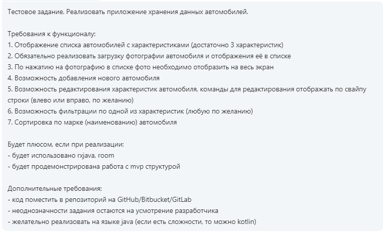

# CarsPresentation
-----------------------------------------------------------------------------------------------------------------------------------------------------
## Задача

*Реализован список автомобилей, отображённый на первичном экране. Новый автомобиль добавляется нажатием кнопки "ADD CAR".
В поле для имени картинки необходимо ввести имя нужного файла из имеющихся в папке "drawable" без указания его расширения!
Задумано таким образом, что фото каждого авто уникально, то есть сколько картинок в папке "res/drawable"столько и автомобилей.
В следующее поле вводится имя модели и описание в свободной форме. Далее целочисленое значение стоиомсти, и в последнее 
поле - целое число (количество лошадиных сил). После проверки данные записываются в БД SQlite. Каждый элемент списка 
можно переносить выше или ниже относительно других, сделав захват длительным нажатием, или вообще удалив с экрана, свапнув
вправо. По клику на фото авто на главном экране происходит её отображение в новой Activity с возможностью её увеличения и 
прокрутки(реализовано с помощью сторонней библиотеки "Subsampling Scale Image View". Обычным кликом по остальным частям
элемента вызывается аткивность по редактированию данных или удалению авто. 
Цветами, стилями, шрифтами и т.п. не занимался совсем.*
-----------------------------------------------------------------------------------------------------------------------------------------------------
## Внешний вид при заполнении списка
